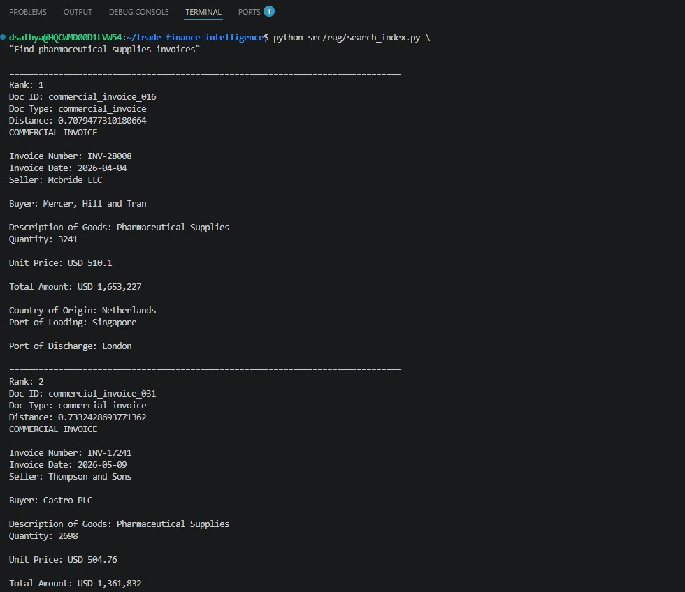

# Trade Finance Intelligence Platform

## Overview

Trade Finance Intelligence Platform is a multimodal AI solution for understanding, classifying, extracting, and searching trade-finance documents.

The platform combines:

* OCR (Tesseract)
* Layout-aware Document Understanding
* LayoutLMv3 Multimodal Classification
* Entity Extraction
* Semantic Search (RAG)
* FastAPI Deployment

The system processes common trade-finance documents including:

* Commercial Invoices
* Bills of Lading
* Letters of Credit
* Packing Lists

---

# Architecture


The platform processes trade-finance documents through OCR, layout extraction, multimodal classification using LayoutLMv3, entity extraction, semantic retrieval using ChromaDB, and FastAPI-based inference services.

---

# Demo Screenshots

## FastAPI Swagger Interface


Interactive API documentation exposed through FastAPI and Swagger UI.

---

## LayoutLMv3 Classification + Entity Extraction


Example Response:

```json
{
  "classification": {
    "doc_type": "commercial_invoice",
    "confidence": 0.9998
  },
  "entities": {
    "seller": "ABC Trading Ltd",
    "buyer": "XYZ Imports LLC",
    "amount": "1250000",
    "country": "Singapore",
    "goods": "Medical Devices"
  }
}
```

---

## Semantic Search API


Example Query:

```json
{
  "query": "Find pharmaceutical supply invoices",
  "n_results": 5
}
```

---

## RAG Retrieval Example



Example semantic search query:

```text
Find pharmaceutical supply invoices
```

Example retrieval output:

```text
Rank 1
Doc Type: commercial_invoice

Rank 2
Doc Type: commercial_invoice

Rank 3
Doc Type: commercial_invoice
```

The system generates dense embeddings using Sentence Transformers and performs semantic retrieval using ChromaDB.

---

# Dataset

A synthetic trade-finance dataset was generated to simulate realistic banking and trade documentation workflows.

| Document Type      | Count |
| ------------------ | ----- |
| Commercial Invoice | 100   |
| Bill of Lading     | 100   |
| Letter of Credit   | 100   |
| Packing List       | 100   |

### Total Documents

```text
400
```

Generated Assets:

```text
400 PDF Documents
400 Images
400 OCR Text Files
400 Layout JSON Files
```

---

# Document Classification

## Model

```text
microsoft/layoutlmv3-base
```

Fine-tuned for trade-finance document classification.

### Input Modalities

* Document Image
* OCR Tokens
* Bounding Boxes

### Output

```json
{
  "doc_type": "letter_of_credit",
  "confidence": 0.9984
}
```

---

# Entity Extraction

The platform extracts important business entities from trade-finance documents.

### Supported Fields

* Seller
* Buyer
* Invoice Number
* Amount
* Country
* Goods Description
* Letter of Credit Number
* Container Number
* Port of Loading
* Port of Discharge

Example:

```json
{
  "seller": "Huff LLC",
  "buyer": "Buchanan-Mason",
  "amount": "226554",
  "country": "India",
  "goods": "Pharmaceutical Supplies"
}
```

---

# Semantic Search (RAG)

## Embedding Model

```text
sentence-transformers/all-MiniLM-L6-v2
```

## Vector Database

```text
ChromaDB
```

### Example Queries

```text
Find pharmaceutical supply invoices

Find letters of credit issued by HSBC

Find documents involving Germany

Find shipments from Singapore

Find bills of lading containing industrial pumps
```

### Workflow

```text
OCR Text
    ↓
Sentence Transformer Embeddings
    ↓
ChromaDB Vector Store
    ↓
Semantic Retrieval
```

---

# Model Performance

## Baseline Model

TF-IDF + Logistic Regression

| Metric   | Value |
| -------- | ----- |
| Accuracy | 1.00  |

---

## Multimodal Model

LayoutLMv3

| Metric   | Value |
| -------- | ----- |
| Accuracy | 1.00  |

Training Configuration:

```text
3 Epochs
GPU: NVIDIA RTX 5000 Ada Generation
```

---

# API Endpoints

## Health Check

```http
GET /
```

Response:

```json
{
  "status": "ok"
}
```

---

## Process Document

```http
POST /process
```

Request:

```json
{
  "image_path": "...",
  "layout_path": "...",
  "ocr_text_path": "..."
}
```

Response:

```json
{
  "classification": {
    "doc_type": "commercial_invoice",
    "confidence": 0.999
  },
  "entities": {
    "seller": "...",
    "buyer": "...",
    "amount": "..."
  }
}
```

---

## Semantic Search

```http
POST /search
```

Request:

```json
{
  "query": "Find pharmaceutical invoices",
  "n_results": 5
}
```

Response:

```json
{
  "results": [
    {
      "doc_id": "...",
      "doc_type": "commercial_invoice"
    }
  ]
}
```

---

# Repository Structure

```text
trade-finance-intelligence/
│
├── docs/
│   └── images/
│       ├── architecture.png
│       ├── swagger_ui.png
│       ├── classification_demo.png
│       ├── semantic_search_demo.png
│       └── RAG_Terminal_Output.png
│
├── reports/
│
├── src/
│   ├── api/
│   ├── classification/
│   ├── extraction/
│   ├── ocr/
│   ├── rag/
│   └── data_generation/
│
├── requirements.txt
└── README.md
```

---

# Repository Notes

The repository contains source code only.

The following artifacts are excluded from source control because of size constraints:

* Synthetic trade-finance dataset
* OCR outputs
* Layout JSON files
* Trained LayoutLMv3 models
* ChromaDB indexes

All artifacts can be regenerated using the provided scripts.

---

# Installation

```bash
git clone https://github.com/Deepak-Sathyanarayanan/trade-finance-intelligence.git

cd trade-finance-intelligence

python3 -m venv venv

source venv/bin/activate

pip install -r requirements.txt
```

---

# Run API

```bash
uvicorn src.api.main:app --reload
```

Swagger UI:

```text
http://localhost:8000/docs
```

---

# Technology Stack

### Machine Learning

* PyTorch
* Hugging Face Transformers
* LayoutLMv3
* Sentence Transformers

### OCR & Document AI

* Tesseract OCR
* Bounding Box Extraction
* Layout-aware Processing

### Retrieval

* ChromaDB
* Vector Search
* RAG

### Backend

* FastAPI
* Uvicorn

### Development Environment

* Python 3.12
* Ubuntu 24.04 (WSL2)
* NVIDIA RTX 5000 Ada Generation

---

# Future Enhancements

* LayoutLMv3 Token Classification for NER
* LLM-based Compliance Summaries
* Ollama / Llama 3 Integration
* Docker Deployment
* Kubernetes Deployment
* AWS SageMaker Training
* AWS EKS Inference
* Human-in-the-loop Validation Workflow

---

# Author

**Deepak Sathyanarayanan**

Document AI • Trade Finance • Multimodal AI • Generative AI
