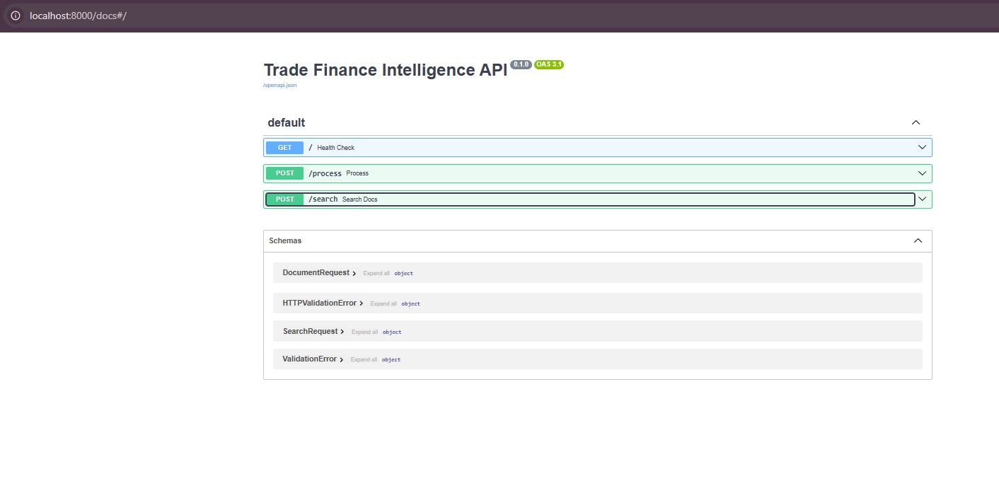
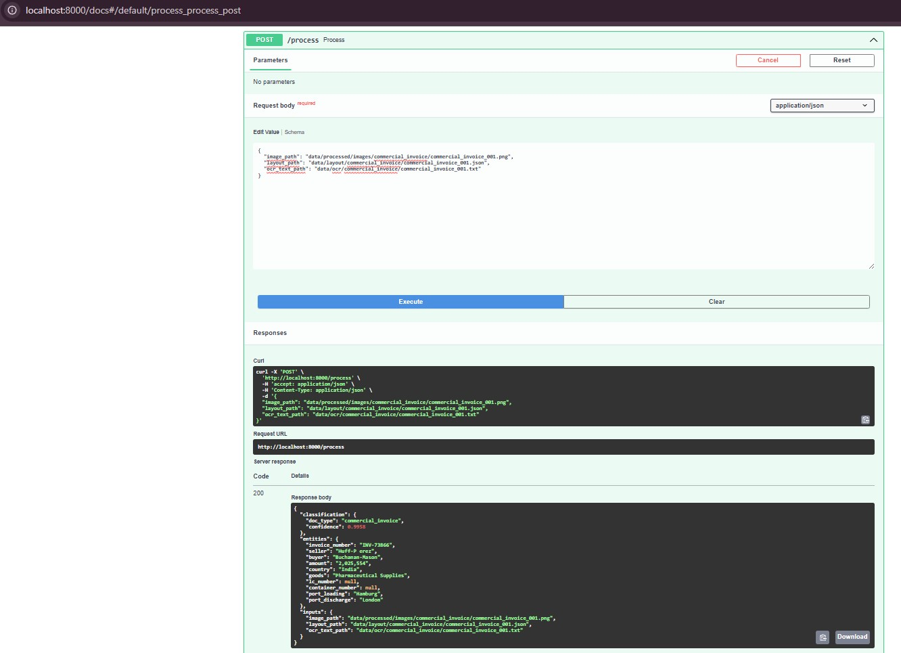
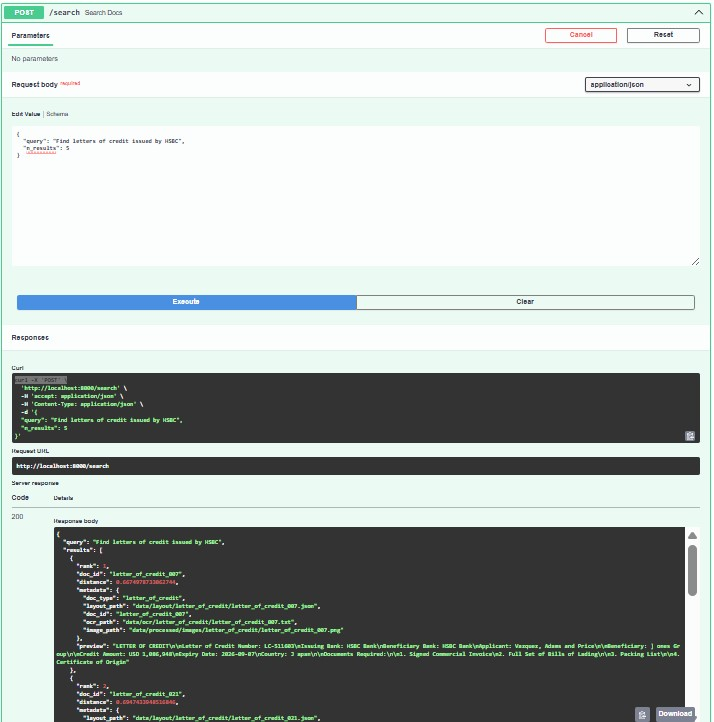

# Trade Finance Intelligence Platform

## Overview

Trade Finance Intelligence Platform is a multimodal AI solution for understanding and processing trade-finance documents.

The platform combines:

* OCR (Tesseract)
* Layout-aware Document Understanding
* LayoutLMv3 Multimodal Classification
* Entity Extraction
* Semantic Search (RAG)
* FastAPI Deployment

The system supports common trade-finance documents:

* Commercial Invoices
* Bills of Lading
* Letters of Credit
* Packing Lists

---

# Architecture

```text
Trade Finance Documents
        |
        v
PDF Documents
        |
        v
Document Images
        |
        v
OCR Extraction
(Tesseract)
        |
        +---------------------+
        |                     |
        v                     v
OCR Text                Layout JSON
                     (Bounding Boxes)
        |                     |
        +----------+----------+
                   |
                   v
             LayoutLMv3
        Document Classification
                   |
                   v
          Entity Extraction
                   |
                   v
      ChromaDB Semantic Search
                   |
                   v
              FastAPI
```

---

# Demo Screenshots

## FastAPI Swagger Interface



---

## LayoutLMv3 Classification + Entity Extraction



Example Response:

```json
{
  "classification": {
    "doc_type": "commercial_invoice",
    "confidence": 0.9998
  },
  "entities": {
    "seller": "ABC Trading Ltd",
    "buyer": "XYZ Imports LLC",
    "amount": "1250000",
    "country": "Singapore",
    "goods": "Medical Devices"
  }
}
```

---

## Semantic Search (RAG)



Example Query:

```json
{
  "query": "Find pharmaceutical supply invoices",
  "n_results": 5
}
```

---

## LayoutLMv3 Training Results


Results:

```text
Accuracy: 1.00
```

---

# Dataset

Synthetic trade-finance dataset generated using Python.

| Document Type      | Count |
| ------------------ | ----- |
| Commercial Invoice | 100   |
| Bill of Lading     | 100   |
| Letter of Credit   | 100   |
| Packing List       | 100   |

Total Documents:

```text
400
```

Generated Assets:

```text
400 PDFs
400 Images
400 OCR Files
400 Layout Files
```

---

# Document Classification

### Model

```text
microsoft/layoutlmv3-base
```

### Inputs

* Document Image
* OCR Tokens
* Bounding Boxes

### Output

```json
{
  "doc_type": "letter_of_credit",
  "confidence": 0.9984
}
```

---

# Entity Extraction

Extracted Fields:

```text
Seller
Buyer
Invoice Number
Amount
Country
Goods
LC Number
Container Number
Port of Loading
Port of Discharge
```

Example:

```json
{
  "seller": "Huff LLC",
  "buyer": "Buchanan-Mason",
  "amount": "226554",
  "country": "India",
  "goods": "Pharmaceutical Supplies"
}
```

---

# Semantic Search (RAG)

Technology Stack:

```text
Sentence Transformers
all-MiniLM-L6-v2
ChromaDB
```

Example Queries:

```text
Find pharmaceutical supply invoices

Find letters of credit issued by HSBC

Find documents involving Germany

Find shipments from Singapore

Find bills of lading containing industrial pumps
```

---

# Model Performance

## Baseline

TF-IDF + Logistic Regression

| Metric   | Value |
| -------- | ----- |
| Accuracy | 1.00  |

---

## Multimodal

LayoutLMv3

| Metric   | Value |
| -------- | ----- |
| Accuracy | 1.00  |

Training Configuration:

```text
3 Epochs
GPU: NVIDIA RTX 5000 Ada Generation
```

---

# API Endpoints

## Health Check

```http
GET /
```

---

## Process Document

```http
POST /process
```

Request:

```json
{
  "image_path": "...",
  "layout_path": "...",
  "ocr_text_path": "..."
}
```

---

## Semantic Search

```http
POST /search
```

Request:

```json
{
  "query": "Find pharmaceutical invoices",
  "n_results": 5
}
```

---

# Installation

```bash
git clone https://github.com/Deepak-Sathyanarayanan/trade-finance-intelligence.git

cd trade-finance-intelligence

python3 -m venv venv

source venv/bin/activate

pip install -r requirements.txt
```

---

# Run API

```bash
uvicorn src.api.main:app --reload
```

Swagger UI:

```text
http://localhost:8000/docs
```

---

# Technology Stack

* Python
* WSL2
* PyTorch
* Hugging Face Transformers
* LayoutLMv3
* Tesseract OCR
* ChromaDB
* Sentence Transformers
* FastAPI
* Uvicorn

---

# Future Enhancements

* LayoutLMv3 Token Classification for NER
* LLM-based Compliance Summaries
* Ollama / Llama3 Integration
* Docker Deployment
* Kubernetes Deployment
* AWS SageMaker Training
* AWS EKS Inference

---

# Author

Deepak Sathyanarayanan

Trade Finance • Document AI • Multimodal ML • Generative AI
